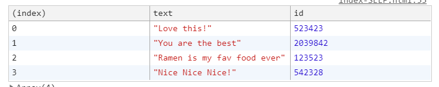

# SPLICE


```
comments.splice(index, 1)
console.log(comments)
```




splice를 새로운 변수에 입력받아 출력하면 splice로 제거한 것이 출력된다. 

```
const newComments = comments.splice(commentIndex, 1)
console.log(newComments)
```

